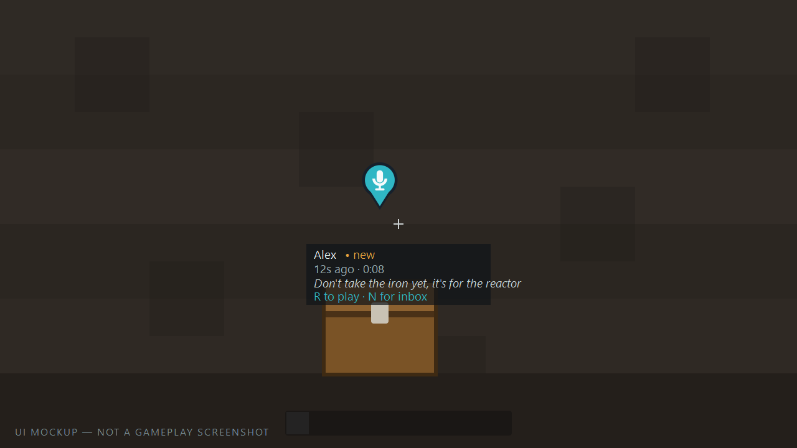
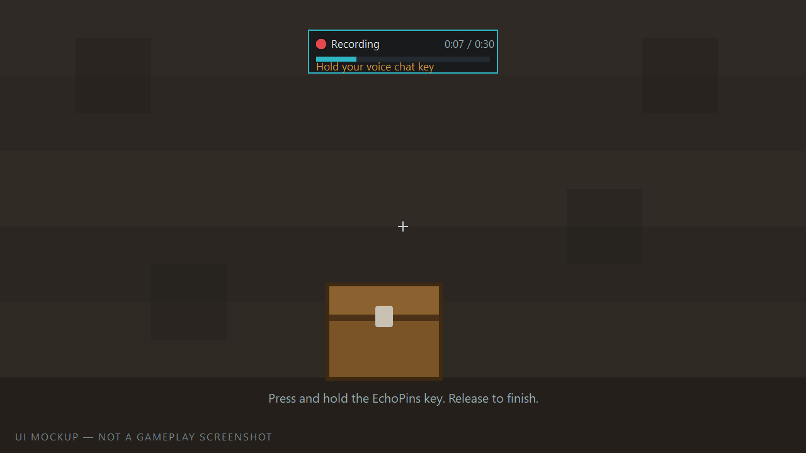

<div align="center">


# EchoPins

**Leave a message where it matters.**

[](https://www.minecraft.net/)
[](https://fabricmc.net/)
[](https://files.minecraftforge.net/)
[](https://neoforged.net/)
[](https://adoptium.net/)
[](https://modrinth.com/plugin/simple-voice-chat)
[](LICENSE)

</div>

---

Your friend logs off. Three hours later you walk into the base and find a chest full of iron,
a half-built machine, and no idea what any of it is for.

EchoPins fixes that. Record a short voice message, leave it stuck to the chest, and whoever
walks up next hears it — whether or not you are online.

<div align="center">

<sub><i>UI mockup — see <a href="branding/SCREENSHOT_PLAN.md">SCREENSHOT_PLAN.md</a></i></sub>
</div>

## What is EchoPins?

EchoPins is **world-anchored asynchronous voice messaging** for Minecraft.

It is *not* a voice chat replacement, *not* a waypoint mod, and *not* Discord inside Minecraft.
It does one thing: it lets you attach a short voice note to a place, and lets your friends
find it later.

```
Near a chest    "Don't take the iron yet, it's for the reactor."
At a portal     "This one comes out by the fortress."
Down a mine     "I went left. There's a spawner on the right."
By a machine    "Don't switch this line on, it's not wired up."
```

## Features

- **Anchored voice notes** — attach a message to a block face, or drop it in mid-air.
- **Works offline** — the author does not need to be online for you to hear their message.
- **Quiet by design** — a small marker fades in as you approach, and nothing else.
- **Public or private** — pick exactly who can hear a message, by UUID.
- **Captions** — optional text alongside the audio, which doubles as an accessibility fallback.
- **Its own volume slider** — a dedicated Simple Voice Chat volume category.
- **Expiry** — messages clean themselves up so world saves do not grow forever.
- **Built for real servers** — spatial indexing, per-player subscriptions, rate limiting and
  storage caps, so it behaves with thousands of pins and a full player list.

## How it works

1. Look at the place that matters.
2. Hold the **Create EchoPin** key (default `B`).
3. Speak. Release the key.
4. Choose public or private, add a caption if you like, and save.

Your friends see a small marker when they get close, and press one key to listen.

<div align="center">

<sub><i>UI mockup</i></sub>
</div>

## Requirements

| Minecraft | Fabric | Forge | NeoForge | Java | Release line |
|---|---:|---:|---:|---:|---|
| **1.21.1** | ✅ | — | ✅ | 21 | [Stable v1.1.1](https://github.com/DarkJest/echopins/releases/tag/v1.1.1) / `main` |
| **1.20.1** | ✅ | ✅ | ✅ | 17 | Beta v1.2.0-beta.1 / branch `1.20.1` |

Both lines remain supported. This branch builds the 1.20.1 artifacts; Minecraft 1.21.1 stays on
the stable `main` line. Every installation requires matching versions of
[Simple Voice Chat](https://modrinth.com/plugin/simple-voice-chat) on both client and server;
Fabric also requires Fabric API.

## Installation

### Client

1. Install Forge 47.4.x, NeoForge 47.1.x, or Fabric Loader plus Fabric API, for Minecraft 1.20.1.
2. Drop **Simple Voice Chat** and **EchoPins** into `mods/`.
3. Launch. Rebind the keys in *Options → Controls → EchoPins* if you like.

### Server

1. Install Forge 47.4.x, NeoForge 47.1.x, or Fabric Loader (plus Fabric API).
2. Drop **Simple Voice Chat** and **EchoPins** into `mods/`.
3. Start the server once to generate `config/echopins-server.toml` (`.json` on Fabric).
4. Read [docs/SERVER_SETUP.md](docs/SERVER_SETUP.md) before opening it to the public.

EchoPins is required on both sides. A client without it will be rejected at the protocol
handshake with a clear message rather than a confusing crash.

## Voice recording behaviour — please read

**EchoPins cannot switch your microphone on.** Simple Voice Chat's public API exposes microphone
audio only once it is already transmitting, and there is no supported way to start capture from
outside. Reaching into its internals to force it would be fragile and, more importantly, a
privacy problem.

What that means in practice:

- **Voice activation:** works exactly as you would expect. Hold the EchoPins key and talk.
- **Push-to-talk:** hold the EchoPins key **and** your normal voice chat push-to-talk key at the
  same time. The recording HUD says so while you record, and tells you when no audio is arriving.

While you are recording an EchoPin, your voice is **not** also broadcast to players standing next
to you (server option `suppressProximityBroadcastWhileRecording`, on by default). Recording a note
is not the same thing as talking to whoever happens to be nearby.

## Privacy

EchoPins records your voice. That deserves to be spelled out, not buried:

- Recording **only** happens while you hold the key. There is no background or hidden capture.
- A prominent indicator is on screen the entire time, with start and stop cues.
- Only **your own** voice is captured — never other players, never ambient proximity chat.
- Audio is stored **on the server**, inside the world save. The server operator controls those
  files, exactly as they control every other part of the world.
- Cancelling discards the recording, and unconfirmed recordings are deleted automatically.

Full detail, including how to delete your messages and how admins wipe voice storage, is in
[PRIVACY.md](PRIVACY.md).

## Server configuration

Everything is in `config/echopins-server.toml`, or `config/echopins-server.json` on Fabric. The defaults are chosen so that an untouched
install cannot be used to fill a disk: pins expire after a week, total storage is capped at 1 GiB,
and both creating and playing are rate limited.

The knobs you are most likely to want:

| Option | Default | What it does |
|---|---|---|
| `maxRecordingSeconds` | `30` | Longest message |
| `defaultExpiryHours` | `168` | One week; `0` means never expire |
| `allowPermanentPins` | `true` | Whether players may opt out of expiry |
| `maxPinsPerPlayer` | `64` | Per-player cap |
| `maxTotalPins` | `5000` | Server-wide cap |
| `discoveryRadius` | `56` | How far away markers appear |
| `maxTotalAudioStorageBytes` | `1 GiB` | Hard storage ceiling |

Every option is documented in [docs/CONFIGURATION.md](docs/CONFIGURATION.md).

## Commands

```
/echopins list                     Pins near you
/echopins mine                     Pins you created
/echopins unread                   Pins you have not listened to
/echopins stats                    Counts
/echopins delete <id>              Delete one of yours
```

Admin (permission level 2 by default):

```
/echopins admin stats
/echopins admin delete <id>
/echopins admin purge expired
/echopins admin purge player <player>
/echopins admin cleanup
/echopins admin reload
```

See [docs/COMMANDS.md](docs/COMMANDS.md).

## FAQ

**Does the author have to be online?**
No. That is the entire point.

**Do I need to be in a voice chat group?**
No. EchoPins uses Simple Voice Chat purely as an audio pipe.

**Can other players hear me while I record?**
No, not by default. See *Voice recording behaviour* above.

**How much disk does this use?**
A 10-second message is roughly 10–20 KB of Opus. A thousand of them is well under 20 MB. There is
a hard cap regardless.

**Does it work in the Nether / End / modded dimensions?**
Yes. Pins store their own dimension and only appear in the right one.

**Will it slow my server down?**
Idle cost is close to nothing. Pins are indexed by chunk, each player is only told about pins near
them, and disk work happens off the server thread. See [docs/ARCHITECTURE.md](docs/ARCHITECTURE.md).

**Can I use a different voice mod?**
Not in 1.0. The backend sits behind an adapter interface, so another one can be added later
without rewriting the mod.

## Screenshots

The images in this README are clearly-labelled **UI mockups** built from the mod's real interface
geometry and strings. Genuine in-game screenshots have not been captured yet;
[branding/SCREENSHOT_PLAN.md](branding/SCREENSHOT_PLAN.md) has the shot list, composition notes
and alt text for whoever takes them.

## Compatibility

- Works on a dedicated server and in single player.
- No mixins into Minecraft or into Simple Voice Chat, and no reflection into its internals — only
  its published plugin API. That is what makes it safe in a large modpack.
- No world generation, no blocks, no items, no entities. Nothing to conflict with.

## Documentation

| | |
|---|---|
| [Installation](docs/INSTALLATION.md) | Client and server setup |
| [Server setup](docs/SERVER_SETUP.md) | Running it in public |
| [Configuration](docs/CONFIGURATION.md) | Every option |
| [Commands](docs/COMMANDS.md) | Full command reference |
| [Architecture](docs/ARCHITECTURE.md) | How it is built, with diagrams |
| [Data format](docs/DATA_FORMAT.md) | The `.epv` audio container |
| [Security model](docs/SECURITY_MODEL.md) | Threat model |
| [Testing](docs/TESTING.md) | Manual test matrix |
| [Troubleshooting](docs/TROUBLESHOOTING.md) | When something is wrong |
| [Privacy](PRIVACY.md) | What is recorded and where it goes |

Russian: [README_RU.md](README_RU.md)

## Support

Bugs and feature requests belong in [GitHub Issues](https://github.com/DarkJest/echopins/issues).
Security issues should follow [SECURITY.md](SECURITY.md) instead of being filed publicly.

## License

[MIT](LICENSE). Simple Voice Chat is a separate project under its own terms; EchoPins bundles no
part of it. See [THIRD_PARTY_NOTICES.md](THIRD_PARTY_NOTICES.md).
