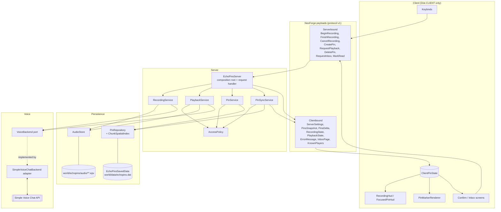
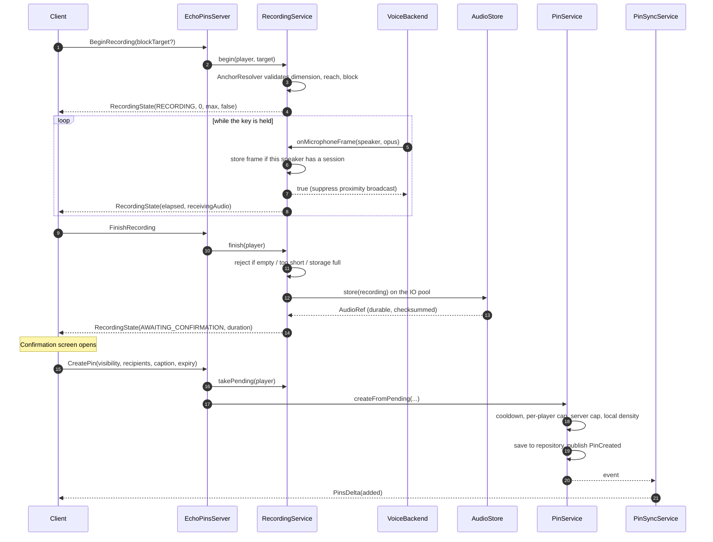
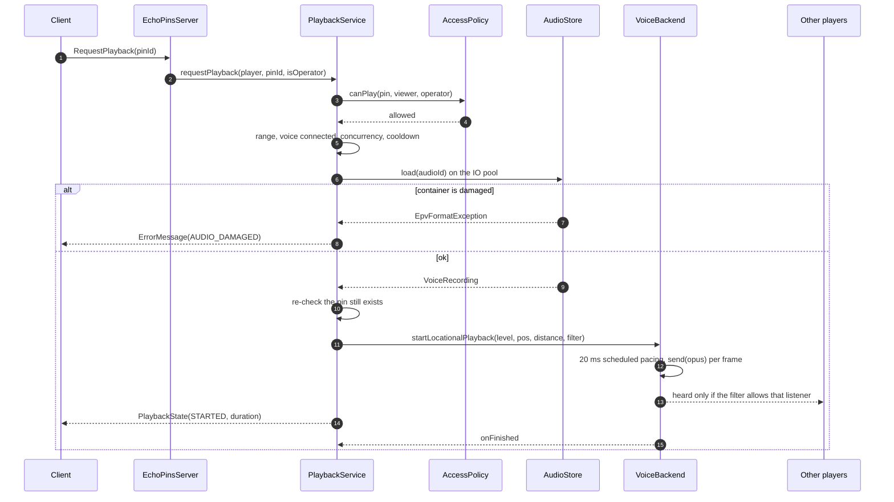

# Architecture

## Principles

1. **The server decides everything.** The client renders and asks; it never asserts.
2. **The domain knows nothing about Minecraft.** `dev.echopins.domain` has zero Minecraft imports,
   which is what makes the interesting logic — access control, expiry, indexing, the audio
   container — testable in a plain JVM.
3. **Client code is physically separate.** Everything that touches rendering lives under
   `dev.echopins.client` and is reached only through a `Dist.CLIENT` entrypoint, so a dedicated
   server never loads it.
4. **Nothing scales with the number of pins.** No per-tick full scan, no per-tick full sync.

## Project layout

EchoPins builds for two loaders from one source tree.

```
common/    everything that is not loader-specific - 90 of the 98 source files
neoforge/  NeoForge entry points, config, networking binding, GameTests
fabric/    Fabric entry points, config, networking binding
```

`common` is not a Gradle subproject: with no loader it has no Minecraft to compile against. Each
loader project adds `common/src/main/java` as a source directory and compiles it against its own
remapped Minecraft. **Both use Mojang mappings**, which is what makes the same source valid for
each without a mapping-translation layer or an extra plugin.

Only a handful of things genuinely differ between the loaders, and each is behind a small seam:

| Difference | Seam |
|---|---|
| Entry points and lifecycle events | Each loader has its own; both call the same services |
| Payload registration and packet transport | `EchoPinsNetwork.Transport` plus a shared payload list |
| Server configuration | `ServerLimits` (NeoForge config vs. JSON on Fabric) |
| Client configuration | `ClientSettings` (same split) |
| Default values | `EchoPinsServerDefaults` / `EchoPinsDefaults`, shared by both |
| Keybinds | Declared once with the vanilla constructor, registered per loader |
| HUD and world-render hooks | Loader callbacks calling `EchoPinsClientCore` |

The protocol itself - which payloads exist and how they encode - lives once in `EchoPinsNetwork`,
so the two builds cannot drift into speaking slightly different wire formats.

## Layers

```
dev.echopins
├── domain/          pure Java — no Minecraft, no NeoForge, no Simple Voice Chat
│   ├── anchor/      DimensionId, WorldPos, WorldAnchor (sealed), BlockAnchor, PositionAnchor
│   ├── pin/         EchoPin, PinId, PinAuthor, Caption
│   ├── audio/       VoiceRecording, AudioRef, AudioStore (port), AudioConstants
│   ├── visibility/  Visibility, AccessPolicy, DefaultAccessPolicy
│   ├── expiry/      ExpiryPolicy, ExpiryChoice, ConfiguredExpiryPolicy
│   ├── limits/      RateLimiter, TokenBucketRateLimiter, CooldownRateLimiter
│   ├── index/       ChunkSpatialIndex
│   ├── repository/  PinRepository, ReadStateRepository, in-memory implementations
│   ├── event/       DomainEventBus, DomainEvents
│   └── error/       EchoPinError, EchoPinException
├── application/     use cases — may use Minecraft server types, never Simple Voice Chat types
│   ├── pin/         PinService, AnchorResolver
│   ├── recording/   RecordingService, RecordingSession
│   ├── playback/    PlaybackService
│   ├── sync/        PinSyncService
│   ├── voice/       VoiceBackend (port)
│   └── ServerLimits (port onto config)
├── infrastructure/  adapters
│   ├── persistence/ EchoPinsSavedData, PinNbtCodec, migration/
│   ├── audio/       FileAudioStore, epv/ (EpvReader, EpvWriter, EpvFormat)
│   ├── network/     payloads, codecs, registration
│   ├── config/      ModConfigSpec definitions, ConfigServerLimits
│   └── concurrent/  EchoPinsExecutors
├── integration/
│   └── voicechat/   EchoPinsVoicechatPlugin, SimpleVoiceChatBackend  (the only SVC-aware code)
├── server/          composition root, commands
└── client/          Dist.CLIENT only — render, hud, screen, keybind, state
```

Dependency direction is strictly inward: `client`/`server` → `application` → `domain`.
`infrastructure` and `integration` implement ports declared by the inner layers.

## System overview



## Voice integration

```mermaid
flowchart LR
    API[[Simple Voice Chat<br/>plugin API]]
    PLUG[EchoPinsVoicechatPlugin<br/>@ForgeVoicechatPlugin]
    ADPT[SimpleVoiceChatBackend<br/>implements VoiceBackend]
    REC[RecordingService<br/>MicrophoneCapture]
    PLAY[PlaybackService]

    API -- constructs --> PLUG
    PLUG -- forwards events --> ADPT
    ADPT -- "onMicrophoneFrame(speaker, opus)" --> REC
    REC -- "true = suppress broadcast" --> ADPT
    PLAY -- startLocationalPlayback --> ADPT
    ADPT -- "LocationalAudioChannel.send(opus)" --> API
```

Two things worth calling out:

- **Simple Voice Chat constructs the plugin**, not EchoPins. It scans NeoForge mod files for the
  `@ForgeVoicechatPlugin` annotation and instantiates the class through its no-arg constructor.
  All state therefore lives in the singleton adapter, and the annotated class is a thin forwarder.
- **Audio is never transcoded.** `AudioChannel.send(byte[])` accepts encoded Opus, so frames go
  microphone → disk → channel unchanged. No decode/re-encode round trip, no generational quality
  loss, and playback costs almost nothing.

## Creating an EchoPin



Audio is written **before** the player confirms. That ordering is deliberate: pin metadata is only
ever created for audio that already exists on disk. If the player cancels, the file is deleted; if
the process dies in between, the file is an orphan and the sweep collects it. The reverse order
could produce a pin whose audio is missing, which the player would experience as a broken message.

## Playback



The audience predicate is evaluated **per listener inside the voice system**, so a private pin's
access rule is applied at the exact point audio would be delivered — not merely when the marker
was shown.

## Synchronisation

A player is told about a pin only if it is within `discoveryRadius`, in their dimension, and
permitted by the access policy. The result is sorted nearest-first and capped at
`maxSyncedPinsPerPlayer`.

Recalculation is skipped entirely unless the player has crossed a chunk boundary, and it is
throttled to `syncIntervalTicks`. Standing still costs nothing. When it does run, only the
difference is sent — a `PinsDelta` of what appeared and what disappeared. A full `PinsSnapshot` is
sent only on join and on dimension change.

Candidate lookup goes through `ChunkSpatialIndex`, which buckets pin ids by dimension and chunk
column, so the cost is proportional to the searched area rather than to the number of stored pins.

## Threading

| Thread | Work |
|---|---|
| Server thread | packet handling, world state, repository mutation, sync |
| `EchoPins-IO-1..2` | reading and writing `.epv` containers, orphan sweeps |
| `EchoPins-Audio-1..2` | 20 ms playback pacing |
| Simple Voice Chat threads | `onMicrophoneFrame` callbacks |

Rules that keep this safe:

- Payload handlers run on the main thread (NeoForge's default), so they may touch world state
  directly.
- Anything read or written on the IO pool comes back via `server.execute(...)` before touching
  shared state or sending packets.
- `RecordingSession` is the one object mutated from two threads, and its frame buffer is guarded.
- Both pools are bounded, named, carry an uncaught-exception handler, and are shut down on server
  stop. The IO queue is bounded too: a saturated queue reports back-pressure rather than growing.

## Extension points

The seams that exist so v1 does not have to be rewritten later:

- `VoiceBackend` — a Plasmo Voice adapter would be a new class, not a refactor.
- `AccessPolicy` — team/claim integrations replace one implementation.
- `AudioStore` — the port takes a `UUID`, never a path.
- `DataMigration` / `DataMigrationRegistry` — schema v2 without breaking existing worlds.
- `DomainEventBus` — a map-mod integration subscribes instead of editing `PinService`.

None of these are a public API in 1.0 and none are stable yet.
